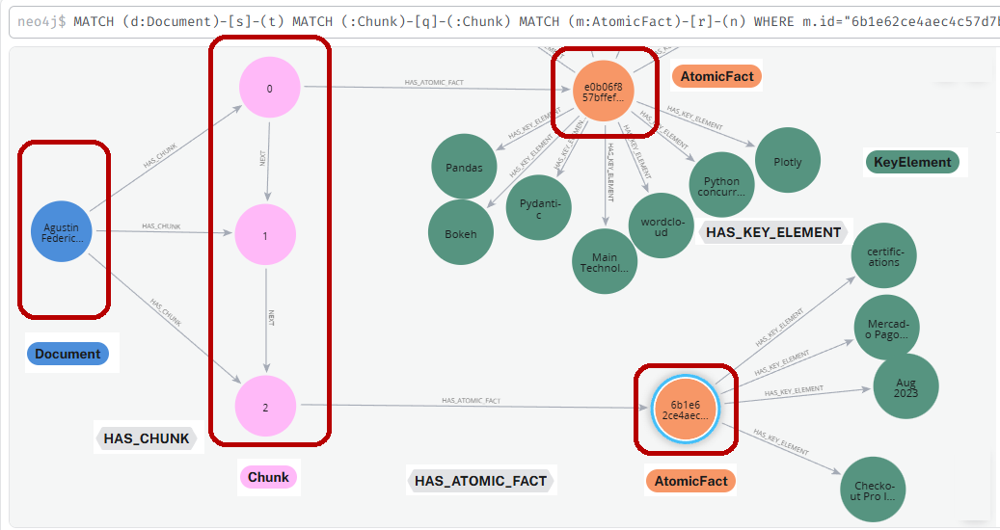
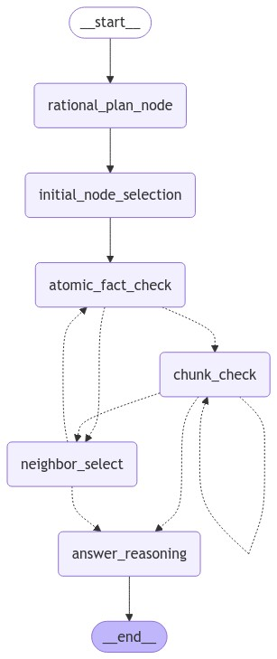
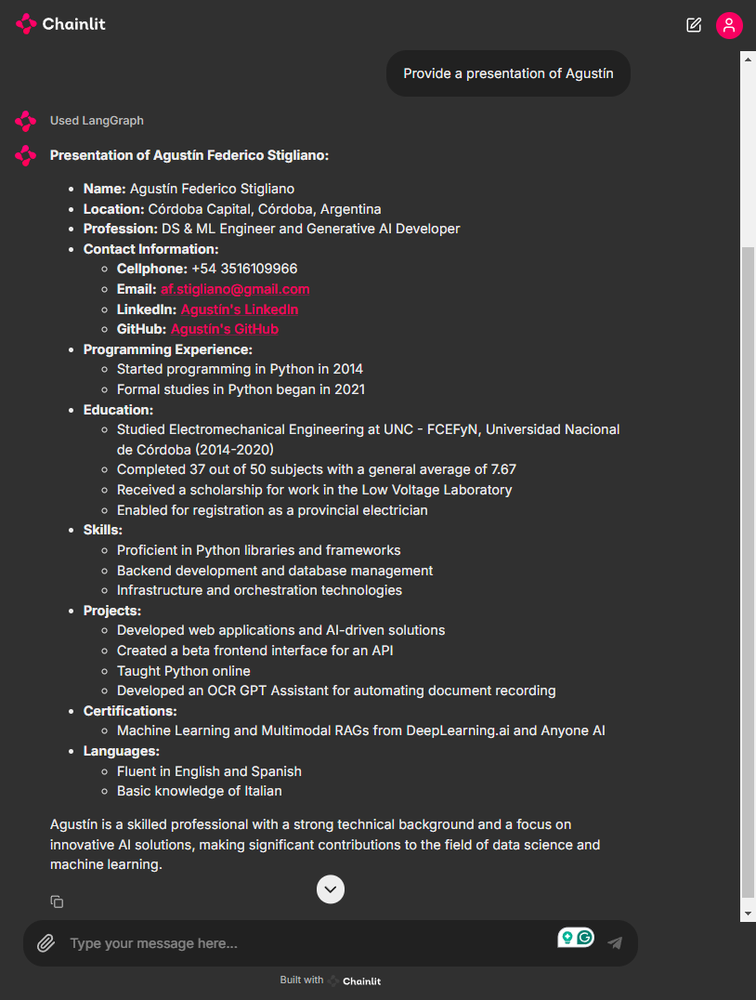

# Graph-based Agent to Enhance Long-Context Abilities of Large Language Models

Technical paper: [arXiv:2406.14550](https://arxiv.org/abs/2406.14550)

Tech-stack: Python, LangChain, LangGraph, Neo4j, AuraDB, Chainlit, python-docx, Pydantic

Models: GPT-4o, GPT-4o-mini

Link: https://agentcv-bcaxembqfjachefy.brazilsouth-01.azurewebsites.net/

## Introduction

La función principal es proveer de un agente inteligente que pueda responder preguntas por medio de un GraphRAG, es decir, el contexto recibido por el agente proviene de un grafo de conocimiento, y éste, por medio de un proceso de exploración paso a paso, va recopilando la data requerida hasta que decide finalizar la exploración y formular la respuesta.

El agente interactúa con el usuario por medio de una interface de chat que está desplegada por medio de los servicios de Microsoft Azure, y el proceso de despliegue se realiza por un pipeline automatizado con GitHub Actions y Docker-hub.

En este caso en particular, la instancia de la base de datos contiene información sobre mi Curriculum Personal, y el agente está diseñado para responder preguntas específicas relacionadas sólo al contenido allí dentro. Aún así, cualquier otro documento puede ser cargado ya sea en formato PDF, o DOCX.

## Graph Database Ingestion

_./knowledge-graph-ingest/**_

La particularidad de este grafo es que está construido a partir de un corpus de texto que se ha procesado y comprimido de la siguiente manera:
- **Document**: The original text corpus.
- **Chunks**: Segments of the original text.
- **Atomic Facts**: The smallest unit of information extracted from the chunks.
- **Key Elements**: words in the text (noun, verb, or adjective) that correlate with several atomic
facts derived from different text chunks.

En donde nosotros sólo podemos intervenir en los parámetros para construir los chunks, debido a que los Atomic Facts y los Key Elements son identificados y procesados automáticamente por un LLM. 

En su implementación actual, la graph database está cargada con datos sobre mi Curriculum Personal, acá se muestra un ejemplo del grafo, habiéndosele aplicado unos filtros para facilitar su visualización:

Una vez la base de datos está cargada, podemos proceder a dar contexto sobre la experiencia del usuario.

## Graph-based Agent and Chat Interface

_./langgraph-agent/**_

En este caso, cuando el usuario provee una pregunta, un agente diseñado por medio de 6 LLM se encarga de responder, previamente habiendo pasado por un proceso de exploración que involucra:
- Inicializar al agente con un plan racional, seleccionar **Key Elements** iniciales, para luego empezar su búsqueda dentro de la graph database.
- El agente primero recolecta **Atomic Facts** y luego lee los **Chunks** relevantes, y actualiza su **notebook** interna.
- El agente puede decidir si explorar más chunks, seleccionar nodos vecinos, o terminar la exploración basado en la cantidad de información recopilada.
- Finalmente, cuando el agente decide terminar la exploración, el step de **answer_reasoning** se encarga de generar la respuesta final del usuario.

A continuación se muestra un diagrama del flujo de trabajo del agente, en él, se puede observar cada LLM dentro de un recuadro, y la secuencia de ejecución que persigue al inferir una respuesta (cuando en el `atomic_fact_check` se seleccionan multiples chunks iniciales, el step `chunk_check` se ejecuta repetidamente - el `chunk_check` es siempre ejecutado después del primer `atomic_fact_check`):

Todos los steps poseen instancias independiente de GPT-4o-mini, excepto por el step de `answer_reasoning`, que utiliza GPT-4o.

La interface con la que interactua el usuario es un chat desarrollado con Chainlit como el que se muestra a continuación con un ejemplo de una conversación y se puede acceder por medio de este [link](https://agentcv-bcaxembqfjachefy.brazilsouth-01.azurewebsites.net/):

Actualmente existe un segundo modelo básico dentro de la interface que permite intersectar inputs de usuario que esten fuera de contexto, para evitar que inputs erróneos sean procesador por el agente. Todas las interacciones son almacenadas en logs para verificar luego cuales inputs fueron rechazados antes de ser procesados por el agente.
A futuro, esto se puede ir salvando, a medida que la base de datos contenga información relacionada a cómo debe responder el agente en estos casos particulares.

### Referencias
- [Creating an AuraDB Instance](https://neo4j.com/docs/aura/auradb/getting-started/create-database/)
- [LangChain Academy](https://academy.langchain.com/users/sign_in)
- [Chainlit Cookbook](https://github.com/Chainlit/cookbook)
- [Azure GitHub Actions deploy](https://learn.microsoft.com/en-us/azure/app-service/deploy-github-actions?tabs=applevel%2Cpythonn%2Caspnetcore#generate-deployment-credentials)

### Further Updates

- Una interface de chat que permita recopilar data interactivamente, para finalmente ser almacenada en la graph database, añadiendo esta informacion a un documento existente previo.
- Un modo dentro de la interface para ingresar información que será almacenada dentro de la database en un documento aparte.
- Deployar la nueva interface utilizando un pipeline de CI/CD.
